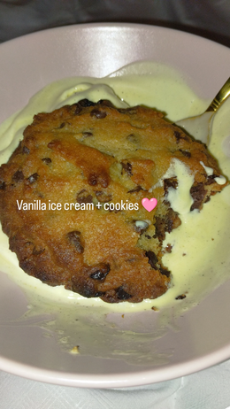

<h1 align="center">Baking page</h1>

<h2 align="center">Fall recipes</h2> 

<h3 align="center">Martha Stewart cookies</h3>

Those are my absolutely favorite cookies ever!!! I literally can't stop making them they are so good! One of these cookies all warm on top of vanilla ice-cream is life-changing, I can't stress this enough!

  

* 2 sticks of salted butter
* 1 1/2 cup of brown sugar
* 1 teaspoon of vanilla extract (or as much as your heart desires 'cause there can never be too much)
* 1 large egg
* 2 cups of flour
* 1/2 teaspoon of baking soda
* chocolate chips (again, as much as your heart desires)
Baked at 180°C for 12 minutes!

<h3 align="center">Grandma's apple pie</h3>

This the best apple pie recipe I've ever tasted, none of them compare to my grandma's recipe and I'm so glad she gave it to me after so long because she was clinging to her secret for dear life. 

* 1 roll of pie dough
* apples (I prefer when they're pink and sweet but to each their own)
* 3 tablespoons of white sugar
* 2 packets of vanilla-flavored sugar
* 3 eggs
* 3 tablespoons of heavy cream
* a bit of milk

[Back to the main page](./index)
