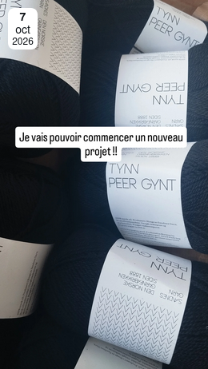

 <h1>Crafts page</h1>

  <h2>WIPs</h2>
I only have 1 work in progress at the moment (well technically 2 but I'm not taking into account my crochet top...) so this is pretty much a victory!! 

[My Froya sweater](https://ingriddyb.com/en-en/products/froya-sweater)
  
So it's far and close to being done at the same time. I can't believe I've been working on it for already 3 months and I still have both sleeves to do 😭😭 Fortunately the first sleeve is almost finished !!

  

 I took a picture before starting the sleeves and this is what it looked like so far.
 

  

  <h2>Project queue</h2> 

  [Maggie Cardigan](https://www.petiteknit.com/en/products/maggie-cardigan)

  I finally started this project since I just received the yarn today. I chose the Tynn Peer Gynt from Sandnes Garn to do my project. 

  

  [Elisabeth Blouse](https://www.petiteknit.com/en/products/elisabeth-blouse)

This is my next project that I'll probably start in November, when (hopefully) I'm done with my froya sweater and my maggie cardigan. 

  <h2>Arts I would love to try</h2>

I would love to try pottery painting. I've seen it all over social media and honestly I had never thought of doing anything pottery-related before, but after seeing all those beautiful dishes I just wanna try so bad. I think I would do something really cutesy with little fruits or tiny flowers painted on them, but I also would love to have a mug with a cartoon-ish painting of my face on it, I just find it so cool.

 
  

<strong>Inspiration 1</strong> 

<strong>Inspiration 2</strong> 

<strong>Inspiration 3</strong> 

  [Back to the main page](./index)
