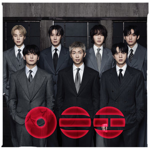
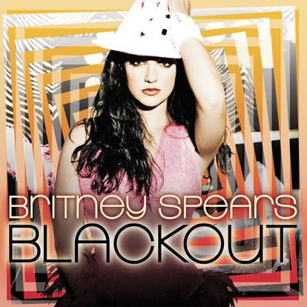

<h1 align="center">Welcome to my ✨fabulous✨ world</h1>

<h2>On loop at the moment</h2>

    <iframe
        src="https://www.youtube.com/embed/lIxQe1R5hs0"
        title="My song of the moment"
        style="position: absolute; width: 100%; height: 100%; border: 0;"
        allowfullscreen>
    </iframe>

<h2>My top 3 album of the moment</h2>

<strong>1. Arirang - BTS</strong> 

<strong>2. B'day - Beyoncé</strong> 

<strong>3. Blackout - Britney Spears</strong> 

    <a href="./crafts">Crafts page</a>
    <a href="./baking">Baking page</a>
    <a href="./book">Current readings</a>

